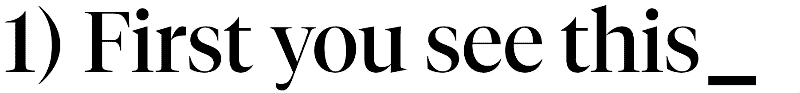

# 💻 useTypingHeadlines

React hook designed to display animated headlines

## Installation

```
npm install use-typing-headlines
```

## Usage

### One headline



```tsx
import { useTypingHeadlines } from 'use-typing-headlines';

const Component = () => {
  const [headline] = useTypingHeadlines([
    'First you see this',
    'Then you see this',
    'Lastly, this',
  ]);

  return <h1>{headline}</h1>;
}
```

### Multiple headlines

```tsx
const Component = () => {
  const [headlineOne] = useTypingHeadlines([
    'Peanut Butter',
    'Copy',
    'Barb',
    'Arts',
  ]);

  const [headlineTwo] = useTypingHeadlines([
    'Jelly',
    'Paste',
    'Star',
    'Crafts',
  ]);

  return <h1>
    {headlineOne} &amp;<br />
    {headlineTwo}<span style={{ visibility: 'hidden' }}>_</span>
  </h1>;
}
```

### Accessibility (BETA)

```tsx
const Component = () => {
  const [headlineLive, headlineStatic] = useTypingHeadlines([
    'This text will be tranlated for screen readers',
    'Updating one full word at a time ...',
  ]);

  return <>
    <h1 role="img" aria-describedby="ariaId">
      {headlineLive}
    </h1>
    <div id="ariaId" aria-live="polite" style={{ visible: 'hidden' }}>
      {headlineStatic}
    </div>;
  </>;
}
```